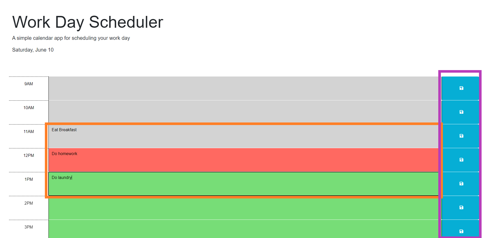

# Work-Day-Scheduler

## Description

Keep track of your day today with a simple work day scheduler. The scheduler will let you save tasks you need to do along with different colored boxes indicating if the time slot has past, is current, or still in the future. 

## Installation

Launch the website at [https://justcallmejayy.github.io/Work-Day-Scheduler/](https://justcallmejayy.github.io/Work-Day-Scheduler/)

## Usage

- Gray means the time slot has already passed, red means it is currently the time slot, green means the time slot is still in the future.
- Type in whatever you would like to schedule in the text box next to the time you would like. The text area is shown in the orange box below
- To save the time slot, click the save button on the right side. As seen in the purple box below
- To clear a time slot, delete what you have in the text area and save again.

